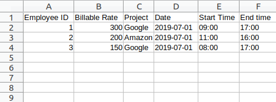
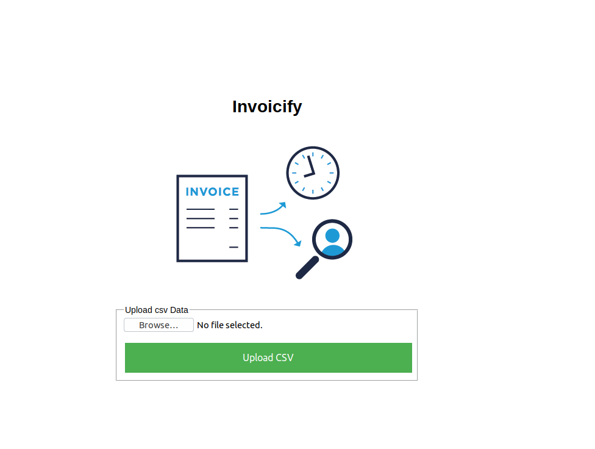
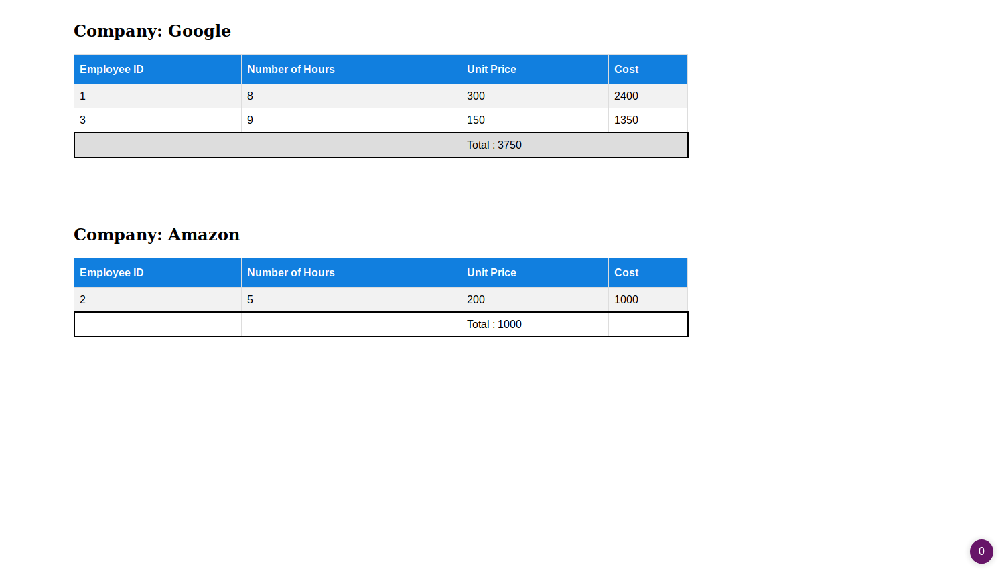

# Invoicify
Generate different web invoices from uploaded csv file.

## Techonology stack
1. **Frontend** : VueJs.
2. **Backend** : Nodejs.
3. **Template Engine** : Ejs (Embeeded Javascripts).
4. **Test** : Mocha & Supertest.
5. **Typescripts** : Yes.
6. **Backend Framework** : Express.

## Clone the repository
1. git clone https://github.com/princesegzy01/invoicify.git into a location of your choice.
2. cd into the folder by running `cd invoicify`.
3. Install all the dependencies by running `npm install`.

## Run Application
1. In the root location of the application, open a new terminal and run `tsc -w` to allow typescripts to watch and compile typescripts file to javascripts.

2. Open another terminal, cd into the root location of your directory and run `npm start` to run the application.
3. Open your browser and navigate to `localhost:3000` to access the application.
4. A sample csv file named `bills.csv` is available at the root of the folder, which can be uploaded to generate the invoice.

## Result

### CSV File format

### Web Interface

### Invoice Result page

### Test
Mocha package is used for creating the test for this application.

1. To test the application run `npm test` from your terminal and see the result.